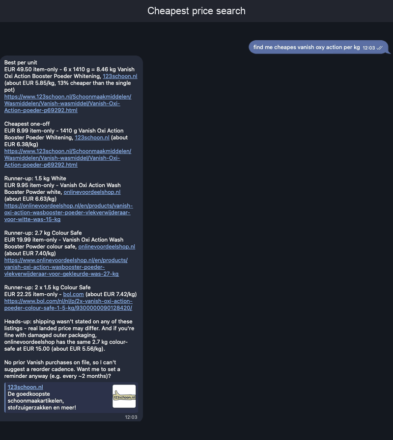

# Scout

**A Telegram shopping and flight researcher that doesn't make things up.**

Scout finds products and flights, compares real prices, and remembers what you
bought. It never buys anything — you get verified links, arithmetic done in
Rust rather than guessed at, and the purchase stays in your hands.

Ask it to fly you somewhere and a flight gets the same suspicion as a bottle of
detergent. Live fares from the airlines themselves, every connection and how
long you wait there, bags counted, the whole trip drawn on one line:

```
AMS 20:15 15.09 ✈ PVG 3h 20m ✈ HKG 20:35 16.09
```

And every price labelled by whether you can actually pay it — because "from
€180" somewhere else and €220 you can book right now are not the same number,
and putting them in one list without saying so is how a comparison lies.

Multi-city trips get built a message at a time and priced only when you say
they're done — because an offer expires in minutes and a plan doesn't, so the
only honest thing to do with a week-old itinerary is search it again.

Built in Rust with [teloxide](https://github.com/teloxide/teloxide),
[rig](https://rig.rs), DuckDB, and a deep suspicion of what language models
say about prices.

<p align="center">
  
</p>

Real output, unedited: every price per kilo, every link verified, and a running
commentary while it works — including the moment it catches its own wrong URL
and goes to find the right one.

---

## Why this exists

Ask any chat model to find you the cheapest detergent and it will answer
confidently. It will also invent product URLs, quote a price from a
recommendations carousel, compare a 3-pack against a single bottle, and
recommend something the shop stopped selling last March.

Scout is what's left after fixing each of those, one production failure at a
time. Every row below was a real bug reported by a real user, and every fix
is pinned by a test.

| What went wrong | What Scout does now |
|---|---|
| Four Amazon links, all fabricated. An invented `/dp/<ASIN>` looks perfectly real and always 404s. | Every link in every reply is probed before sending. Dead ones trigger a correction turn, then get struck from the text. |
| Quoted €12.99 for a bottle the page priced at €13.80 — the €12.99 came from a "related items" strip. | Prices are read from the page's **structured data** (JSON-LD, microdata, or the shop's embedded app state) for the exact URL opened — never from flattened page text. |
| **€640 for a €6.48 bottle of cola.** The shop published two JSON-LD blocks: `"6.48"` and `"648"` (cents), and we picked the wrong one. | Relative URLs resolve properly, a price written with decimals beats a bare integer, and anything exactly 100× the page's OpenGraph price is corrected. |
| Recommended a bol.com listing marked *Niet leverbaar*. The page returns HTTP 200, so nothing looked wrong. | Stock status comes from schema.org markup. Prose is ignored — that page says "Niet leverbaar" once and "In winkelwagen" seven times, all from its carousel. |
| Compared a €15 3-pack against a €35 single and called the 3-pack cheaper. | A `compare_prices` tool does the arithmetic **in Rust**: landed cost (item + shipping), price per unit, exact ranking. The model reports numbers, it doesn't compute them. |
| A user was left staring at a half-written progress message forever. | Every run is bounded — stalled stream, total runtime, wrap-up. Running out of steps produces a partial answer from what was found, never silence. |
| Sticker price ranked a €15.17 listing above a €35.25 one; shipping was €16.98 vs €2.21. | Comparisons are on **landed cost**. Offers that don't state shipping still compete, but their prices are labelled item-only. |
| Reddit's bot wall answers **HTTP 200** with a plausible shell, so it came back as a page that merely had nothing on it — and the model opened three more just like it, then stalled. | A bot check is an **error**, not content, and it tells the model to stop opening that host. Reddit threads are read through `old.reddit.com`, which serves the whole thread to a plain GET: 8 KB of interstitial becomes 69 KB with every comment. |

The theme: **the model decides what to look for, Rust decides what's true.**

---

## What it does

**Finds things**
- Conversational search with follow-ups — "only under €20", "what about second-hand?"
- Two search engines (Kagi + Perplexity) merged and deduplicated. On the same
  Dutch query their results overlapped by **2 URLs out of 20** — each finds
  small shops the other misses
- Searches in your local languages as well as English, all in one call.
  "laundry detergent" finds nothing on a Dutch shop; "wasmiddel" does
- Favourite shops, scoped by category — "always check 123schoon.nl for
  cleaning products". Small shops never rank organically, even under their
  product's exact name; a `site:` query is the only way to reach them
- Send a **photo**, get a drafted search description to edit and confirm

**Verifies things**
- Opens product pages and extracts the real link, price, seller and stock
- Pages that block plain HTTP get re-opened in **headless Chrome**, which
  clears the challenge shops like action.com put in front of them
- Live APIs where they exist: eBay Browse, Marktplaats, and bol.com Catalog
  if you have an approved affiliate account — current prices, no scraping.
  Each is optional; without one, those shops still arrive through search and
  get read the same way as any other page
- Second-hand search across eBay / Marktplaats / Vinted in parallel, with
  sold and deleted listings filtered out

**Flies you places** *(optional — needs a Duffel and/or Ignav key)*
- Live fares with times, stops, flight numbers and baggage, grouped **in
  Rust** into cheapest, fastest and best balance — one to two each, never
  the same flight twice, and the balance heading is dropped when no option
  genuinely beats both extremes. Each leg draws itself on one line:
  `AMS 20:15 15.09 ✈ PVG 3h 20m ✈ HKG 20:35 16.09` — copied into the reply
  verbatim, because a model retyping departure times is a model that can get
  one wrong
- Says **where you change and how long you wait**, and shouts when a
  connection moves you between airports or the trip is two separate tickets
- `flex_days` prices a **±3 day window** in one call and reports the cheapest
  fare per day. Measured on AMS–LIS: €101 to €143 across one week
- **Two providers, merged and labelled.** Duffel sells live bookable offers;
  Ignav sells fare data that its own docs say to show as *"from $299"*. Every
  row carries its source and whether the price is bookable, and Rust says so
  loudly when an approximate fare undercuts one somebody could actually pay
- **Booking links** open the airline's own page with the flight already
  selected. The fare is re-checked at that moment, and a price that moved
  since it was quoted is reported rather than glossed over
- Scout never takes a payment or a passenger detail — there is nothing to leak

**Plans whole trips** *(same keys)*
- A **trip** is a named multi-city plan you build across as many messages as
  it takes — "Amsterdam → Lisbon on the 3rd, Lisbon → Rome on the 7th, home
  on the 12th, call it September" — and come back to tomorrow
- Undecided between a nonstop and a connection? Park **both** on the same
  segment and choose later. Extra options cost nothing: a segment is priced
  by one search, and that search returns every option sitting on it
- A trip stores the **itinerary**, never an offer. Offers expire in minutes
  and a plan outlives the conversation that made it, so finalising re-prices
  every segment from scratch rather than repeating a number from Tuesday
- Finalising also asks Duffel what the **whole itinerary costs as one
  ticket**, and shows both totals. Booking a link per segment is buying a
  ticket per segment: bags re-checked at every join, and nobody obliged to
  rebook you when a leg runs late. That difference is priced, not implied
- A flight you chose that is **no longer sold** is reported, never
  substituted. You picked a flight, not a price band
- Totals refuse rather than lie: no sum across mixed currencies, and no
  comparison between two prices quoted in different ones. A missing
  single-ticket price says it is missing — it never reads as a verdict for
  booking separately

**Remembers things**
- Purchase history: *"where did I buy this last time?"* — react 👍 to a
  suggestion and Scout offers to save it
- Your profile: delivery country, sizes, preferred marketplaces, languages.
  Injected into every request so it stops re-asking
- Reorder reminders for things you buy periodically, delivered in Telegram
- `/stat` for usage with a text bar chart — your own numbers, or everyone's
  if you're the admin. Flight searches are counted separately, because
  those are the ones a provider bills for
- `/advert <text>` — admin only, announces something to everyone who has
  used the bot. It goes to the chat each person actually talks in, says who
  sent it, and reports who could not be reached

**Behaves itself**
- Streams progress live — which tool is running and on what — then the answer
  as it's written, all in one edited message, with the typing indicator held
  up throughout so a slow step never looks like a crash
- Sessions reset after 10 idle minutes, with an LLM check that restores
  context when you're clearly continuing the same topic
- Hard caps on searches, page opens and turns per request, so no single
  question can run away with your API budget. Asking the same route twice in
  one request is answered from memory rather than bought twice
- **Deploys without cutting anyone off.** `scripts/deploy.sh` builds the new
  image while the old one is still serving, then hands over: the bot stops
  taking messages and finishes what it is already doing before it exits

---

## Quick start

```bash
git clone https://github.com/watchcat/scout && cd scout
cp .env.example .env    # fill in the four required keys
docker compose up -d --build
```

You need four things:

1. A bot token from [@BotFather](https://t.me/BotFather)
2. Your numeric Telegram id from [@userinfobot](https://t.me/userinfobot) —
   Scout only answers people on the allowlist
3. A [MiniMax API key](https://www.minimax.io) (the LLM)
4. A [Kagi API key](https://kagi.com/settings?p=api) (search, paid)

Everything else is optional and makes Scout better as you add it.

Prefer to run it directly? `cargo run` — the first build takes a while, DuckDB
compiles from source.

### Configuration

| Variable | Required | Default | Purpose |
|---|---|---|---|
| `TELEGRAM_BOT_TOKEN` | **yes** | — | bot token from @BotFather |
| `ALLOWED_TELEGRAM_USER_IDS` | **yes** | — | comma-separated numeric ids |
| `SCOUT_ADMIN_USER_IDS` | no | first allowed id | who sees everyone's numbers in `/stat`; everyone else sees only their own |
| `MINIMAX_API_KEY` | **yes** | — | the LLM |
| `KAGI_API_KEY` | **yes** | — | search: small-retailer coverage, `site:` scoping |
| `PERPLEXITY_API_KEY` | no | — | second engine, merged with Kagi; carries the multi-language fan-out cheaply |
| `EBAY_CLIENT_ID` + `EBAY_CLIENT_SECRET` | no | — | eBay Browse API: live prices, condition, shipping |
| `EBAY_MARKETPLACE` | no | `EBAY_NL` | eBay marketplace id |
| `BOL_CLIENT_ID` + `BOL_CLIENT_SECRET` | no | — | bol.com Catalog API; needs an **approved** affiliate account, which bol.com may decline |
| `BOL_COUNTRY` | no | `NL` | `NL` or `BE` |
| `DUFFEL_API_KEY` | no | — | flight search. A `duffel_test_` key is free and returns Duffel's fake airline; a live key bills per search |
| `DUFFEL_MARKUP_RATE` | no | — | booking fee as a rate (`0.03` = 3%). Applied to quoted prices **and** the checkout, so they cannot diverge; refuses to start without `DUFFEL_LINKS_ENABLED` |
| `DUFFEL_LINKS_ENABLED` | no | `false` | Duffel gates hosted checkout on new accounts — set once they enable it |
| `IGNAV_API_KEY` | no | — | second flights provider. 1,000 free requests, then $0.002 each. Prices are approximate, not bookable, and labelled as such |
| `SECONDHAND_SITES` | no | `ebay.com,marktplaats.nl,vinted.com` | second-hand domains |
| `SCOUT_CHROME` | no | auto-detected | Chrome/Chromium for the headless fallback |
| `SCOUT_DB_PATH` | no | `scout.duckdb` | DuckDB file |

Keys are read from `.env` at runtime and never baked into the image. Memory
lives in the `scout-data` volume and survives rebuilds.

---

## How it works

```
Telegram ──► bot.rs ──► rig agent (MiniMax M3) ──► 23 tools
                │                                    │
                │  streams progress + answer         ├─ search_web        Kagi + Perplexity, merged
                │  back into one edited message      ├─ search_secondhand eBay / Marktplaats / Vinted
                │                                    ├─ search_bol        bol.com catalogue *
                ▼                                    ├─ search_flights    Duffel + Ignav, merged *
        link verification                            ├─ flight_booking_links  airline pages, pre-filled *
        (nothing dead ships)                         ├─ create_booking_link   Duffel hosted checkout *
                                                     ├─ fetch_page        + headless-Chrome fallback
                                                     ├─ compare_prices    deterministic, in Rust
                                                     ├─ add_trip_segment  ─┐
                                                     ├─ add_trip_option    │
                                                     ├─ choose_trip_option │  a named multi-city
                                                     ├─ show_trip          ├─ plan, built over many
                                                     ├─ update_trip_segment│  messages
                                                     ├─ drop_trip_segment  │
                                                     ├─ delete_trip        │
                                                     ├─ finalise_trip     ─┘  re-prices it all *
                                                     ├─ query_purchases   ─┐
                                                     ├─ record_purchase    ├─ DuckDB
                                                     ├─ remember_fact      │
                                                     ├─ forget_fact       ─┘
                                                     └─ reminders (create/list/cancel)

        * registered only when its credentials are set — bol.com needs an
          approved affiliate account, and they do reject applications;
          Duffel and Ignav both hand out free keys, though Duffel gates
          hosted checkout until they enable it for you
```

The agent chooses tools; the tools enforce the rules. Page budgets, search
budgets, dead-link probes, price extraction and the price maths all live in
Rust, where they can be tested — `cargo test` runs **374 tests** with HTTP
mocked via wiremock and DuckDB on temp files. No network, no API keys, no
flakiness.

Roughly 19,500 lines of Rust across a dozen focused modules.

---

## Honest limitations

- **Curated marketplaces.** eBay, bol.com, Marktplaats and Vinted are wired in
  deliberately; everything else arrives through general web search. Excellent
  for NL/EU, thinner elsewhere.
- **Some of those APIs are gated.** eBay and bol.com both want developer or
  affiliate accounts, and bol.com turns applications down. Each integration
  is optional and Scout runs fine without it — the shop just goes back to
  being an ordinary page found by search and read for its structured data.
- **Flight prices are quotes, not seats.** A Duffel offer expires minutes
  after it is made, so a fare Scout quoted is a fare that *was* available.
  Ignav's are weaker still — approximate by its own documentation, which is
  why they are labelled rather than merged in silently. Scout never books, and
  never repeats a price from earlier in the conversation; it searches again.
  Airport codes are the model's job, so a wrong one is a wrong answer rather
  than a silent one.
- **Nobody can price a whole month.** Neither provider has a calendar
  endpoint, so a range costs one search per day. ±3 days is the ceiling; the
  big sites answer month views from caches of indicative fares, which is a
  different and less honest product.
- **A finalised trip hands out links unevenly.** Ignav segments resolve to
  real sellers; Duffel segments give you the airline and the flight numbers
  and nothing to click, because Duffel gates hosted checkout until they
  enable it for an account. The single-ticket comparison is Duffel-only for
  the same shape of reason — Ignav has one-way and round-trip endpoints and
  no way to price a multi-city itinerary at all. Without a Duffel key that
  half of finalising simply says it could not be done, which is deliberately
  not the same as saying separate booking won.
- **Not every wall falls.** Headless Chrome clears Cloudflare on some shops and
  not others. When a page can't be verified, Scout says so rather than
  guessing.
- **A shop that lies convincingly wins.** If a page publishes only a
  bare-integer cents price with nothing to cross-check, Scout reports that
  number instead of inventing a division.
- **Allowlist only.** This is built as a personal/household bot. Conversation
  state, purchase memory and `/stat` are scoped per user — but everyone on
  the allowlist shares one process, one database file and one API budget.
- **Costs real money.** Kagi bills per query, MiniMax per token, and each
  flight search is billed by whichever provider answered it. Budgets are
  capped per request: 15 search queries, 5 page opens, 20 model turns, and
  flight searches that start at 4 and grow with what you actually asked for —
  a ±3 day window is seven searches because neither provider prices a
  calendar, and finalising an N-segment trip is N+1. Parking extra options on
  a segment adds nothing, because they are all priced by the one search that
  segment was going to cost anyway. Measured: a flight question runs about
  **1.4 cents** end to end.

---

## Development

```bash
cargo test                  # 374 tests, no network needed
cargo clippy --all-targets  # clean
RUST_LOG=debug cargo run    # verbose logs
docker compose logs -f      # what the bot is doing right now
scripts/deploy.sh           # test, build, drain, hand over
scripts/deploy.sh --dry-run # show the plan, change nothing
```

A handful of tests are `#[ignore]`d because they call the real APIs. They are
how the local-time trap, the USD-instead-of-EUR default and a booking lookup
that rejects its own market parameter were all found — each after a mocked
test had happily asserted the opposite:

```bash
cargo test -- --ignored --nocapture   # needs the relevant keys in .env
```

Docker builds use BuildKit cache mounts: a code change rebuilds in **~20s**, a
dependency change in ~5s, because Cargo's registry and `target/` survive layer
invalidation. Only a cold cache pays the full compile.

---

## License

[MIT](LICENSE) — do what you like with it.
